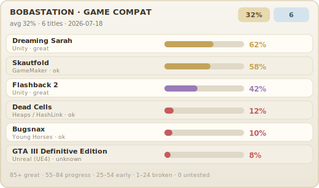

# BobaStation

**BobaStation** is a free, open-source project based on
[KytyPS5](https://github.com/KytyPS5/KytyPS5) - with Boba flavors on top.
It is a work-in-progress. Compatibility is **super limited**. Expect rough edges
- nothing sweet like boba yet.

> [!IMPORTANT]
> We're not Sony. We're not PlayStation. BobaStation is a free research /
> hobby host - we **don't** ship games, firmware, or any of their copyrighted
> stuff. Only run dumps **you** own and got legally. Don't be weird about it.

## What it is

BobaStation is a reverse-engineering research project focused on **emulation**
and **compatibility testing** - a place to try theories and host/guest launch
paths on Windows.

BobaStation is a Windows host app plus a **guest_core** PlayStation 5
compatibility runtime. Play launches **`guest_core.exe`**.

## Game compatibility

## guest_core

**guest_core** is derived from open-source PS5 emulation projects, then
recompiled and rebuilt for BobaStation as **`guest_core.exe`**.

## Credits

Inspired by and based on the **Kyty** and **KytyPS5** projects.

* **Kyty** - [InoriRus](https://github.com/InoriRus/Kyty) (MIT)
* **KytyPS5** - [Nmzik / KytyPS5](https://github.com/KytyPS5/KytyPS5) (`GPL-2.0-only`)

## Special thanks

Built by Grok Build (4.5)

## License

BobaStation is licensed under the [GNU General Public License version 2](LICENSE)
(`GPL-2.0-only`).
